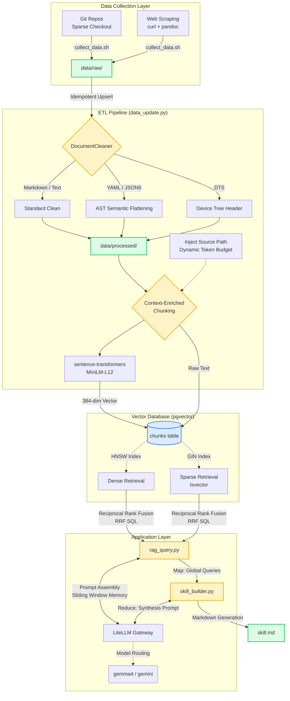

[](https://classroom.github.com/a/mhxNhwtV)
# Build-Your-Personal-RAG

## Project Overview

本專案旨在打造一個專為 OpenBMC 韌體開發者設計的 RAG 知識檢索系統。
*   OpenBMC 架構龐大且複雜，涵蓋高階 Web API (Redfish)、中介軟體 (D-Bus IPC) 以及底層硬體配置 (Entity Manager, Device Tree)。傳統的關鍵字搜尋難以跨越這些技術棧，因此需要一個能理解上下文的 RAG 系統來輔助開發。
*   **資料來源與規模：** 透過 Sparse Checkout 精準提取 OpenBMC 官方的 5 個核心 Repositories（包含 `.md`, `.yaml`, `.json`, `.dts` 等格式），並輔以 IBM Power10 的官方教學文件，總計超過 1117 份文件。
*   **技術選型：** 採用 `pgvector` 作為向量資料庫，實作 Hybrid Search (Dense + Sparse) 與 RRF 融合演算法，並透過 `LiteLLM` 統一介接多種 LLM 模型。

## System Architecture


## Design Decisions

> 💡 本系統選擇從底層刻劃 Data Pipeline 與 Retrieval 邏輯，以精確應對 OpenBMC 韌體工程領域的特殊資料型態。以下為核心技術節點的決策與理由：

*   **Chunking 策略 (Markdown-Aware & Context-Enriched)**
    *   **切分邊界：** 放棄單純的固定長度切分，改採 **Markdown-Aware** 策略。優先以段落 (`\n\n`) 與標題 (`#`) 為邊界，並實作特殊規則：**絕對不從中截斷 Code Fences (` ``` `) 與 Markdown 表格**，確保 C++ 程式碼與 D-Bus 屬性表的語意完整性。
    *   **Context Enrichment：** 為解決 Chunking 導致的Semantic Fragmentation，在每個 Chunk 開頭強制注入 `[Context: <source_path>]`。這確保了即使 Chunk 內只有一句 "Returns the current state"，Embedding 模型也能將其錨定 (Anchor) 在正確的硬體模組語意空間中。
    *   **長度與 Overlap：** 設定 $C_{size} = 512$ tokens（以字元數/4 動態估算），$C_{overlap} = 64$。在注入 Context Prefix 時，會動態扣除 Prefix 長度以計算該 Chunk 的預算。

*   **Embedding model選擇 (Local Multilingual Model)**
    *   **選型：** `sentence-transformers` 的 `paraphrase-multilingual-MiniLM-L12-v2`。
    *   **選擇理由：** 考慮到 IBM Power10 OpenBMC 文檔是中文，因此使用 HW3.md 推薦的 `paraphrase-multilingual-MiniLM-L12-v2`

*   **Vector DB 選型 (pgvector with HNSW & GIN)**
    *   **選型：** PostgreSQL 搭配 `pgvector` 擴充套件。
    *   **選擇理由與評估：** 曾評估過 ChromaDB，但 ChromaDB 缺乏強大的關聯式查詢與全文檢索能力。選擇 PostgreSQL 是因為它能**在同一個資料庫內同時支援 Vector Search 與 Full-Text Search**。
    *   **索引優化：** 捨棄 IVFFLAT，改採 **HNSW (Hierarchical Navigable Small World)** 索引。HNSW 支援Incremental Upsert 且不掉 Recall 率，完美契合本系統的 File-level Upsert 更新策略。

*   **Retrieval 策略 (Hybrid Search with RRF)**
    *   OpenBMC 文件充滿了精確的 D-Bus 路徑（如 `xyz.openbmc_project.State.Host`）與 JSON 變數。單純的 Dense Retrieval (語意檢索) 可能因為 Out-of-Vocabulary (OOV), 長路徑或是程式碼變數而找不到精確字串。考慮到蒐集資料特性因此採用 hybrid Search
    *   **RRF 融合：**  **Reciprocal Rank Fusion (RRF)** 演算法 ($k=60$)。透過 SQL 的 CTE (Common Table Expressions) 將 RRF 運算直接下推 (Push-down) 至資料庫層，大幅降低 Python 端的記憶體開銷。
    *   **Top-K：** 互動問答預設 `top-k=5`；在 `skill_builder.py` 進行全域知識萃取時放寬至 `top-k=15` 以提升覆蓋率。

*   **Prompt Engineering (Strict Citation & Sliding Window)**
    *   **System Prompt：** 賦予 LLM "Senior Firmware Engineer" 的人設，並制定嚴格的 **"I Don't Know" Policy** 以防範幻覺。
    *   **強制引用：** 在 Prompt 中明確規範 `For every piece of information, append: [Source: <source_file>, Chunk: <chunk_index>]`，確保回答具備 100% 的可溯源性。
    *   **記憶體管理：** 實作 **Sliding Window Memory**，僅保留最近 3 輪對話。為控制 Token 成本，歷史紀錄中**僅保存乾淨的 Query 與 Answer**，刻意丟棄過去檢索到的龐大 Context。

*   **Idempotency 設計 (File-level Upsert & Orphan Cleanup)**
    *   **Hash 比對：** `data_update.py` 掃描 `data/raw/` 時，會計算檔案的 SHA-256 Hash 並與 DB 紀錄比對。未變動則 Skip，變動則執行 `DELETE` 後重新 `INSERT`。
    *   **Orphan Cleanup：** 系統會反向比對 DB 內的 source 清單與本地檔案系統。若實體檔案已被刪除，程式會自動從 DB 中 `DELETE` 對應的 Chunks，確保 DB 永遠是 `data/raw/` 的完美鏡像，達成嚴格的冪等性。

*   **skill_builder.py 問題設計 (Domain-Specific Map-Reduce)**
    *   **架構：** 採用 Map-Reduce 模式。先發散檢索，再將 Context 聚合交由 LLM 進行 Markdown 結構化融合。
    *   **全域問題設計：** 揚棄籠統的提問，設計了 5 個 OpenBMC 架構的 Domain-Specific Queries：
        1.  **高階架構：** `bmcweb` 與 Redfish API 的實作。
        2.  **IPC 通訊：** `phosphor-dbus-interfaces` 的核心合約。
        3.  **硬體配置：** `entity-manager` 的 JSON 動態映射機制。
        4.  **底層抽象：** Linux Device Tree (`.dts`) 與 GPIO 監控。
        5.  **生命週期：** 韌體更新 (Code Update) 與安全機制。
    *   **為什麼這樣設計：** 問題精準對應 Sparse Checkout 抓下來的 5 個不同 Repository。強迫 RAG 系統跨越 API、中介軟體、硬體設定檔與 OS 核心，萃取出真正具備「全端韌體視野」的 Agent Skill。


## Reproduce Instructions
```python
# 1. 確認 Python 版本
python3 --version        # (developed with 3.10.7)

# 2. 建立並啟動虛擬環境
python3 -m venv .venv
source .venv/bin/activate

# 3. 安裝套件
pip install -r requirements.txt

# 4. 設定環境變數
cp .env.example .env
# 請將 .env 中的 LITELLM_API_KEY 和 LITELLM_BASE_URL 填入助教提供的值

# 5. 啟動 Vector DB（使用 pgvector）
docker compose up -d
docker compose ps        # 確認 pgvector 狀態為 running

# 6. 全量重建索引
python data_update.py --rebuild

# 7. 測試 RAG 問答
python rag_query.py --query "請問這個知識庫的核心主題是什麼？"

# 8. 生成 Skill 文件
python skill_builder.py --output skill.md
```

**複現完整性檢查清單（繳交前自行驗證）：**

- [x] 在全新目錄 `git clone` 後，能按照上述順序無誤執行所有指令
- [x] `docker-compose.yml` 使用相對路徑（若有）
- [x] `.env.example` 存在且不含真實金鑰
- [x] `requirements.txt` 第一行有 Python 版本備註
- [x] `data/processed/` 中有清理後的 `.txt` 檔案（已 commit）
- [x] `python data_update.py --rebuild` 執行後無 Error，Vector DB 有資料
- [x] `python rag_query.py --query "..."` 能回傳含引用來源的答案


## Data Sources Statement

| 來源名稱 | 類型 | 授權 / 合規依據 | 數量 |
|---|---|---|---|
| OpenBMC 官方文檔 (openbmc/docs) | `.md` | Apache 2.0 | 完整版本庫 |
| OpenBMC BMCWeb | `.md`, `.cpp` | Apache 2.0 | docs + README |
| OpenBMC Phosphor D-Bus Interfaces | `.yaml`, `.yml`, `.md` | Apache 2.0 | yaml目錄 + README |
| OpenBMC Entity Manager | `.md`, `.conf` | Apache 2.0 | configurations + docs + README |
| OpenBMC Linux (設備樹) | `.dts`, `.md` | GPL 2.0 | devicetree + 文檔 |
| OpenBMC Phosphor GPIO Monitor | `.md` | Apache 2.0 | README |
| 社群研究資源 (openbmc_research) | `.md`, `.py`, `.txt` | 依原倉庫 | 完整版本庫 |
| IBM Power10 OpenBMC 文檔 | `.md` | IBM 在線文檔許可 | 1 篇 |

## Limitations & Future Work 
礙於openBMC提供的規格書通常上下文語意關聯度不高，因此在執行`python rag_query.py`時會得到LLM無法提供回覆等訊息，。因此搜尋的文件未來可能需要擴展至網路上提供的技術手冊或教學，但網路資源提供的內容若要作為data base亦須評估適合度。


### Showcase: multi-turn Conversation
節錄自測試用對話:
```
🧑 User: 總結我們剛剛的對話

[*] Embedding query & Searching...

[*] Retrieved Context Sources:
  1. [Source: openbmc-docs/tof/contract.md, Chunk: 2] (Score: 0.0164)
  2. [Source: openbmc-docs/code-of-conduct.md, Chunk: 5] (Score: 0.0161)
  3. [Source: openbmc-docs/security/obmc-security-response-team-guidelines.md, Chunk: 2] (Score: 0.0159)
  4. [Source: openbmc-docs/cpp-style-and-conventions.md, Chunk: 1] (Score: 0.0156)
  5. [Source: openbmc-docs/CONTRIBUTING.md, Chunk: 4] (Score: 0.0154)
  6. [Source: phosphor-dbus-interfaces/yaml/xyz/openbmc_project/Control/Host.interface.yaml, Chunk: 1] (Score: 0.0152)
  7. [Source: openbmc-docs/designs/mctp/mctp-kernel.md, Chunk: 7] (Score: 0.0149)
  8. [Source: openbmc-docs/architecture/redfish-logging-in-bmcweb.md, Chunk: 1] (Score: 0.0147)
  9. [Source: openbmc-docs/process/subproject-maintainership.md, Chunk: 4] (Score: 0.0145)
  10. [Source: openbmc-docs/designs/bmc-service-failure-debug-and-recovery.md, Chunk: 10] (Score: 0.0143)
  11. [Source: openbmc-docs/cpp-style-and-conventions.md, Chunk: 4] (Score: 0.0141)
  12. [Source: openbmc-docs/designs/redfish-eventservice.md, Chunk: 17] (Score: 0.0139)
  13. [Source: openbmc-docs/process/subproject-maintainership.md, Chunk: 7] (Score: 0.0137)
  14. [Source: openbmc-docs/code-of-conduct.md, Chunk: 2] (Score: 0.0135)
  15. [Source: openbmc-docs/designs/uart-mux-support.md, Chunk: 9] (Score: 0.0133)
  16. [Source: openbmc-docs/designs/mctp/mctp-kernel.md, Chunk: 10] (Score: 0.0132)
  17. [Source: openbmc-docs/testing/local-ci-build.md, Chunk: 2] (Score: 0.0130)
  18. [Source: openbmc-docs/process/subproject-maintainership.md, Chunk: 3] (Score: 0.0128)
  19. [Source: openbmc-docs/development/dev-environment.md, Chunk: 4] (Score: 0.0127)
  20. [Source: openbmc-docs/designs/ncsi-coredump.md, Chunk: 1] (Score: 0.0125)

[*] Generating Answer...

============================================================
🤖 Assistant:
好的，我們來總結一下這次對話的主要內容：

**專案概述：**
你是一位研究生，正在準備一個在 OpenBMC 中實作 GPIO 的專案。

**核心問題與解答：**

1.  **是否需要立即購買開發板？**
    *   **不需要。** 你可以先在軟體模擬器 QEMU 中進行大部分的開發和測試。
    *   只有當你需要驗證 GPIO 引腳的實際硬體操作、驅動程式行為以及與物理設備的互動時，才需要考慮購買開發板。

2.  **QEMU 模擬器是什麼？**
    *   QEMU 是一個**軟體模擬器**，它允許你在沒有實際硬體的情況下，運行一個虛擬的 OpenBMC 系統。
    *   它是 OpenBMC 開發環境的核心，提供了編譯、運行和測試你程式碼的平台，並可透過網路介面（如 SSH）與虛擬 BMC 互動。

3.  **如何在 QEMU 中使用 `devtool` 建構和測試變更？**
    *   **設定環境：** 確保已完成開發環境設定，並在 BitBake 環境中執行過 `. setup`。
    *   **提取原始碼：** 使用 `devtool modify <repository_name>` 將目標 repository 的原始碼提取到你的本地工作區。
    *   **修改程式碼：** 在 `workspace/sources/<repository_name>/` 目錄中進行你的 GPIO 相關程式碼修改。
    *   **單獨建構：** 使用 `bitbake <repository_name>` 只重新建構你修改的元件。
    *   **設定 QEMU 檔案系統：** 登入 QEMU 後，設定 overlay 檔案系統，以便你能將新編譯的二進位檔寫入 `/usr/bin`。
    *   **部署到 QEMU：** 使用 `scp` 將你編譯的二進位檔複製到 QEMU 實例中。
    *   **驗證：** 在 QEMU 中運行你的應用程式，並透過日誌或直接執行來驗證你的變更。

4.  **Device Tree GPIO 命名設計文件與開發：**
    *   **文件存在：** 你手邊實際上**有**這份關鍵文件：`openbmc-docs/designs/device-tree-gpio-naming.md`。
    *   **開發方向：** 依據這份文件來指導你的專案開發。

5.  **Modern GPIO Interface (現代 GPIO 介面) 的說明：**
    *   **淘汰 `sysfs`：** Linux 核心已棄用傳統的 `sysfs` 介面來操作 GPIO，因為其限制較多。
    *   **基於描述符的字元設備介面 (Descriptor-based Character Device Interface)：** 這是新的、底層的核心介面，透過檔案描述符來操作 GPIO 線路，提供更精確、原子性的控制。
    *   **`libgpiod` 函式庫：** 這是一套 C/C++ 函式庫和工具，為上述新的字元設備介面提供了高階抽象，讓開發者更容易使用 API 來讀取、寫入、監聽 GPIO 事件等。**你的專案應該基於 `libgpiod` 進行開發。**
    *   **Device Tree 整合：** `libgpiod` 允許你透過在 Device Tree (`.dts` 或 `.dtsi` 檔案) 中為 GPIO 線路定義的名稱 (`gpio-line-names`) 來存取它們，這提供了更好的**可讀性和可移植性**，避免了硬編碼 GPIO 號碼。
    *   **GPIO Hogs：** Device Tree 也支持 GPIO hogging 機制，允許在核心啟動時自動配置 GPIO 到特定狀態。
    *   **OpenBMC 實例：** `phosphor-gpio-monitor` 等服務就是利用 `LineName` 在其配置檔案中定義和監控 GPIO 的良好範例。

**總結開發流程建議：**

1.  **從 QEMU 入門：** 先在 QEMU 中設定開發環境，熟悉 OpenBMC 的工具鏈（Yocto, BitBake, `devtool`）。
2.  **核心邏輯開發：** 使用 `libgpiod` 在 C/C++ 中編寫你的 GPIO 應用程式，並在 QEMU 中進行功能測試。
3.  **參考命名慣例：** 仔細閱讀 `openbmc-docs/designs/device-tree-gpio-naming.md`，並在你的程式碼中遵循其定義的 `gpio-line-names`慣例。
4.  **硬體驗證（後續階段）：** 當軟體邏輯完善後，再引入實際的開發板進行最終的硬體集成和驗證。

這次對話為你的 OpenBMC GPIO 專案提供了明確的起步指南、必要的工具使用方法，以及關於現代 GPIO 介面的重要概念。
```

### Troubleshooting

**Q：執行 `data_update.py` 時遇到 `psycopg2.errors.UndefinedColumn: column "fts_vector" does not exist` 怎麼辦？**
A：這常發生在舊版資料庫 Schema 殘留的情況下（例如之前執行到一半突然中斷，資料表已建立）。
**解法一：** 關閉當前的 Docker 容器與掛載的 Volume 資料，然後重新啟動：
```bash
# 停止容器並刪除掛載的 Volume (清除所有舊資料與 Schema)
docker compose down -v

# 重新啟動乾淨的資料庫
docker compose up -d

# 重新執行全量建置
python data_update.py --rebuild
```
**Q：為什麼套件是安裝 `psycopg2-binary`而不是 `psycopg2`?**
A：`psycopg2` 是 Python 與 PostgreSQL 資料庫之間溝通的套件。為了達到最高的執行效率，它的核心部分直接使用 C 語言編寫，以調用 PostgreSQL 的底層 C API (libpq)。使用預先編譯好的版本`psycopg2-binary`可以減少需要額外編譯或是額外設定路徑等流程。